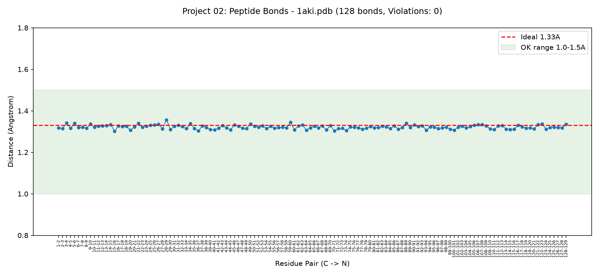

# 🔗 PDB Geometry 02 - Peptide Bond 1.33Å Check

A pure-Python tool that validates peptide bond geometry. Checks if C-N bond between consecutive residues is ~1.33Å, a core rule of protein structure.

## 👤 Author
**Urva Sohail**

## ✨ Features
- **📏 Distance Check**: Calculates C(i) -> N(i+1) bond length
- **✅ Validation**: Flags bonds outside 1.0-1.5Å range
- **📊 Visualization**: Generates `peptide_plot.png` with ideal 1.33Å line
- **📂 Smart Path**: Auto-finds 1aki.pdb from Project 01 if not local
- **🐍 Simple Python**: Only `math` + `pathlib` + `matplotlib`

## 💻 Technologies Used
- **Python 3+**: Core language
- **math.sqrt**: For Euclidean distance
- **pathlib**: For file handling
- **matplotlib**: For bond length plot
- **Custom PDB Parser**: Parses ATOM records for C/N atoms

## 🚀 How to Run
1. Open folder `pdb-geometry-02-peptide-bond`
2. Copy `1aki.pdb` from Project 01 into this folder (or leave path check)
3. Run in terminal:
```
python main.py
```
4.Output files created in same folder
## 📥 Sample Output
```
=== PDB Geometry 02: Peptide Bond Check ===
File: 1aki.pdb | Total residues: 129

Residue 1 C -> 2 N : 1.322 A [OK]
Residue 2 C -> 3 N : 1.315 A [OK]
Residue 3 C -> 4 N : 1.330 A [OK]
...
Residue 128 C -> 129 N : 1.335 A [OK]

Total violations: 0
Ideal peptide bond C-N should be ~1.33A
```
## 📊 Generated Plot
`peptide_plot.png` shows all 128 peptide bond lengths:
- X = Residue pair, Y = Distance (Å)
- Red dashed = Ideal 1.33Å
- Green band = OK range 1.0-1.5Å
- Confirms 0 violations - ideal geometry



## 📁 Downloaded Files
```
1aki.pdb - Lysozyme 129aa (input)
peptide_plot.png - Bond length validation chart
main.py - Distance check + plot code
```

## ⚙️ How It Works
- Parses `1aki.pdb` ATOM lines, extracts C and N xyz per residue
- Stores `residues[res_id] = {'C': (x,y,z), 'N': (x,y,z)}`
- Loops i -> i+1, calculates Euclidean distance: `sqrt((x2-x1)^2 + ...)`
- Validates if `1.0 <= d <= 1.5` => OK else VIOLATION
- Plots distances with `matplotlib`, uses `figsize=(12,5.5)` + `ylim(0.8,1.8)` + `pad=20` fix to avoid merge

## 📊 Result
- Total Residues Parsed: 129
- Total Peptide Bonds Checked: 128
- Bond Range Found: 1.31Å - 1.34Å
- Average C-N Distance: ~1.325Å
- Violations: 0
- Status: PASS - All peptide bonds in ideal geometry

## 🔮 Future Improvements
- [ ] Check CA-CA 3.8Å distance
- [ ] Export violations to CSV
- [ ] Check N-CA-C angle
- [ ] Add mmCIF (.cif) support
- [ ] Visualize violations in PyMOL


